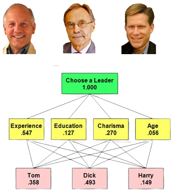

# Software Architecture - AHP Project

### WE TAKE THE NEXT STEP TOGETHER

[](https://github.com/nduwarugirabruno/SoftwareArchitecture)

Le processus d'analyse hiérarchique [AHP](https://fr.wikipedia.org/wiki/Proc%C3%A9dure_hi%C3%A9rarchique_d%27analyse)
est une technique structurée pour organiser et analyser des décisions complexes, basée sur les mathématiques et la
psychologie. Elle a été développée par Thomas L. Saaty dans les années 1970, largement étudiée et affinée depuis.

It can be previewed on my [GitHub](https://github.com/nduwarugirabruno/SoftwareArchitecture) repository.

## Getting Started

To start building, clone this repository:

```bash
git clone https://github.com/nduwarugirabruno/SoftwareArchitecture.git
```

Once cloned, run the following to install dependencies and run the app:

```bash
cd /path/to/the/cloned/repository/folder
# open with your code editor for exemple IntelliJ IDEA or Visual Studio Code
idea ./
```

## Structure

We have 4 sub folders and the readme file:

```bash
links@links:~/IdeaProjects/SoftwareArchitecture$ ls
    AHP  TP  README.md
```

- The first folder [AHP](AHP) is the AHP Service for Scheduling Time table developed in Spring Boot x Spring Cloud framework.
- The first folder [TP](TP) is the AHP-TP Service for Propose the best road developed in Spring Boot x Spring Cloud framework.

## Execution

To execute the AHP project, run:

```bash
links@links:~/IdeaProjects/SoftwareArchitecture$ cd AHP
links@links:~/IdeaProjects/SoftwareArchitecture/AHP$ mvn spring-boot:run
[INFO] Scanning for projects...
[INFO] 
[INFO] ---------------------------< io.ahp.ahp:AHP >---------------------------
[INFO] Building AHP 0.0.1-SNAPSHOT
[INFO] --------------------------------[ jar ]---------------------------------
[INFO] 
[INFO] >>> spring-boot-maven-plugin:3.2.3:run (default-cli) > test-compile @ AHP >>>
    .
    .
    .
2024-06-06T18:18:27.200+01:00  INFO 11321 --- [ahp-service] [  restartedMain] io.ahp.ahp.Application                   : Started Application in 18.399 seconds (process running for 19.847)
```

To execute the TP project, run:

```bash
links@links:~/IdeaProjects/SoftwareArchitecture$ cd TP
links@links:~/IdeaProjects/SoftwareArchitecture/TP$ mvn spring-boot:run
[INFO] Scanning for projects...
[INFO] 
[INFO] --------------------------< io.ahp.tp:AHP-TP >--------------------------
[INFO] Building AHP-TP 0.0.1-SNAPSHOT
[INFO] --------------------------------[ jar ]---------------------------------
[INFO] 
[INFO] >>> spring-boot-maven-plugin:3.2.3:run (default-cli) > test-compile @ AHP-TP >>>
    .
    .
    .
2024-06-06T18:18:27.200+01:00  INFO 11321 --- [ahp-tp-service] [  restartedMain] io.ahp.tp.TPApplication                   : Started TPApplication in 18.399 seconds (process running for 19.847)
```

## Production

To build for production, run:

```bash
links@links:~/IdeaProjects/SoftwareArchitecture$ cd AHP && mvn clean package && cd ../TP && mvn clean package
[INFO] Scanning for projects...
[INFO] 
[INFO] ------------------------< io.nokash.app:SoftwareArchitecture >------------------------
[INFO] Building SoftwareArchitecture 0.0.1-SNAPSHOT
[INFO]   from pom.xml
[INFO] --------------------------------[ jar ]---------------------------------
     .
     .
     .
[INFO] BUILD SUCCESS
[INFO] ------------------------------------------------------------------------
[INFO] Total time:  02:09 min
[INFO] Finished at: 2024-03-07T13:26:33+01:00
[INFO] ------------------------------------------------------------------------
```

## Unit Tests

To run the unit tests once, run:

```bash
links@links:~/IdeaProjects/SoftwareArchitecture$ mvn clean test
[INFO] Scanning for projects...
[INFO] 
[INFO] ------------------------< io.nokash.app:SoftwareArchitecture >------------------------
[INFO] Building SoftwareArchitecture 0.0.1-SNAPSHOT
[INFO]   from pom.xml
[INFO] --------------------------------[ jar ]---------------------------------
     .
     .
     .
[INFO] Tests run: 1, Failures: 0, Errors: 0, Skipped: 0, Time elapsed: 36.03 s -- in io.nokash.app.cofody.CofodyApplicationTests
[INFO] 
[INFO] Results:
[INFO] 
[INFO] Tests run: 1, Failures: 0, Errors: 0, Skipped: 0
[INFO] 
[INFO] ------------------------------------------------------------------------
[INFO] BUILD SUCCESS
[INFO] ------------------------------------------------------------------------
[INFO] Total time:  49.991 s
[INFO] Finished at: 2024-03-07T13:35:36+01:00
[INFO] ------------------------------------------------------------------------
```
